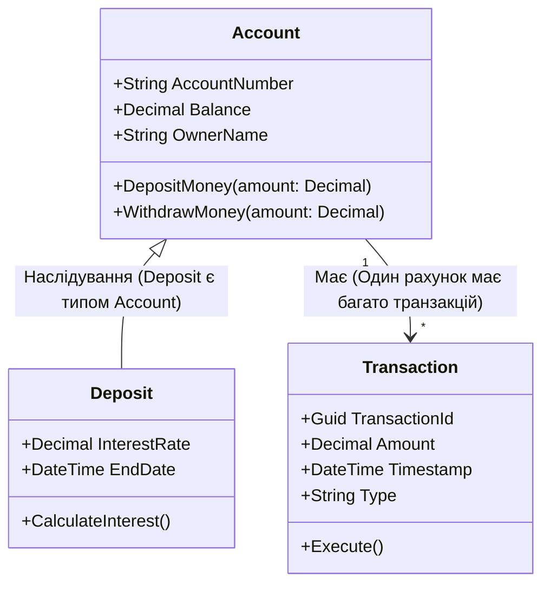
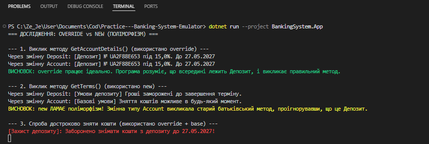
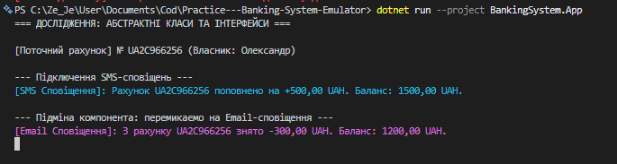
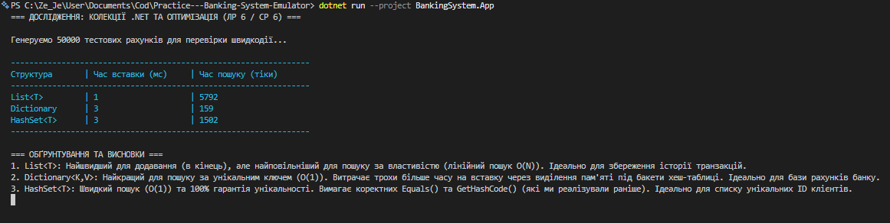

# Емулятор банківської системи (Banking System Emulator)

Цей проєкт є навчальним мініпроєктом з об'єктно-орієнтованого програмування (ООП). Його мета — побудувати архітектурно продуманий та покритий тестами застосунок від UML-моделі до готового продукту.

##  Опис предметної області

Проєкт моделює роботу базової банківської системи. 
**Основні сутності системи:**
* **Рахунки (Accounts):** Базова одиниця для зберігання коштів клієнта.
* **Депозити (Deposits):** Спеціалізовані рахунки з логікою нарахування відсотків.
* **Транзакції (Transactions):** Історія операцій поповнення та зняття коштів.

##  Заплановані патерни проєктування (Design Patterns)

В процесі розробки будуть імплементовані наступні патерни:
1. **Strategy:** Для розрахунку та нарахування різних типів відсотків за депозитами.
2. **Command:** Для виконання фінансових операцій та можливості їх відміни (Undo).
3. **Observer:** Для системи сповіщень користувача про зміну балансу або статусу транзакції.

---

##  UML Діаграма класів (UML Class Diagram)

Нижче наведена базова діаграма предметної області (Domain Model), створена за допомогою Mermaid:



---

##  Структура рішення та запуск

Проєкт побудовано відповідно до вимог архітектури C#-рішень і розділено на три модулі:
* `BankingSystem.Domain` — бібліотека класів (сутності предметної області та бізнес-логіка).
* `BankingSystem.App` — консольний застосунок (точка входу, інтерфейс користувача та запуск колекції/емулятора).
* `BankingSystem.Tests` — проєкт для автоматизованого модульного тестування.

### Як запустити програму:
Команда для виконання в кореневій папці рішення:
```bash
dotnet run --project BankingSystem.App
```

### Як запустити тести:
```bash
dotnet test
```
---

##  Дослідження: Override vs New (Самостійна робота 3)

В рамках розробки було досліджено різницю між перевизначенням методів (`override`) та їх приховуванням (`new`). 

**Задокументований висновок:** Поліморфна поведінка (`override`) є коректнішою та безпечнішою. Якщо банк зберігає колекцію різних рахунків у єдиному списку базового типу (наприклад, `List<Account>`), використання **`override`** гарантує (через пізнє зв'язування), що виконається специфічний метод дочірнього класу (наприклад, `Deposit`). 
Використання **`new`** ламає поліморфізм: при зверненні через змінну базового типу викликається старий батьківський метод, а специфічна логіка дочірнього об'єкта повністю ігнорується.

*Результат виконання програми, що наочно підтверджує це твердження:*



---

##  Контрактне програмування та підміна компонентів (Практична 4 / Самостійна 4)

Клас `Account` було перетворено на **абстрактний клас**, який концентрує в собі спільну логіку для всіх типів рахунків, забороняючи пряму інстанціацію базової сутності.

Для реалізації принципу **слабкого зв'язку (Loose Coupling)** було спроєктовано ізольований контракт — інтерфейс `INotificationService`. Розроблено дві альтернативні взаємозамінні імплементації:
1. `SmsNotificationService` (відправка SMS)
2. `EmailNotificationService` (відправка Email)

**Результат дослідження:** Архітектура дозволяє динамічно підміняти компоненти системи сповіщень під час виконання програми (Runtime) без модифікації коду самого рахунку.

*Демонстрація підміни сервісу сповіщень на льоту:*



---

## Аналіз швидкодії колекцій .NET (Практична 6 / Самостійна 6)

Для оптимізації зберігання даних було проведено порівняльне тестування продуктивності (`List<T>`, `Dictionary<TKey, TValue>` та `HashSet<T>`) на обсязі **50 000 записів**.

**Висновки щодо вибору структур даних:**
1. **`List<T>`**: Показав найшвидший час послідовної вставки, але катастрофічно повільний пошук за властивістю (лінійна складність **O(N)**). *Оптимально використовувати для зберігання хронології (наприклад, списку транзакцій).*
2. **`Dictionary<K, V>`**: Абсолютний лідер за швидкістю пошуку завдяки хешуванню (**O(1)**). Витрачає мінімально більше часу на вставку через алокацію бакетів. *Оптимально для головного сховища рахунків, де часто відбувається пошук за унікальним номером.*
3. **`HashSet<T>`**: Забезпечує швидкий пошук та гарантує унікальність об'єктів. *Оптимально для збереження унікальних ідентифікаторів сесій або клієнтів.*

*Результати профілювання (Stopwatch Benchmark):*

