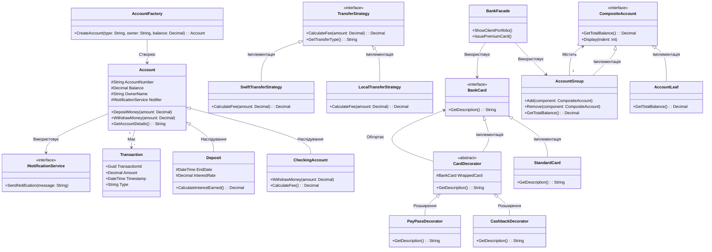

# Емулятор банківської системи (Banking System Emulator)

Навчальний проєкт з об'єктно-орієнтованого програмування (ООП) для побудови архітектурно продуманої та покритої тестами банківської системи.

## Опис предметної області

Проєкт моделює роботу сучасної банківської системи з можливістю управління рахунками, переказами, портфелями активів та виданням платіжних карток.

**Основні сутності системи:**
- **Рахунки (Accounts):** Базова одиниця для зберігання коштів клієнта
- **Депозити (Deposits):** Спеціалізовані рахунки з нарахуванням відсотків
- **Транзакції (Transactions):** Історія операцій поповнення та зняття коштів
- **Платіжні картки (BankCards):** Картки зі спеціальними функціями (кешбек, PayPass)
- **Портфелі (Portfolio):** Ієрархічні групи рахунків для управління активами

---

## Архітектура та Design Patterns

Проєкт імплементує сім основних паттернів проектування:

1. **Strategy:** Алгоритми розрахунку комісій за перекази (локальні vs міжнародні)
2. **Factory Method:** Динамічне створення різних типів рахунків
3. **Observer:** Система сповіщень про зміни балансу та статусу
4. **Decorator:** Послідовна побудова функціональності платіжних карток
5. **Composite:** Побудова ієрархічних портфелів активів
6. **Facade:** Спрощений інтерфейс до складних підсистем
7. **Singleton:** Централізований управління банківськими процесами

---

## UML Діаграма архітектури (UML Class Diagram)

Розширена архітектура системи з усіма основними компонентами:



---

## Структура рішення та запуск

Проєкт розділено на три модулі відповідно до архітектури C#-рішень:

- **`BankingSystem.Domain`** — бібліотека класів з бізнес-логікою та сутностями
- **`BankingSystem.App`** — консольний застосунок з інтерактивним меню
- **`BankingSystem.Tests`** — автоматизоване модульне тестування (43 тести)

### Запуск програми:
```bash
dotnet run --project BankingSystem.App
```

### Запуск тестів:
```bash
dotnet test
```

---

## Функціональність

### Інтерактивне меню демонстрації:
- **Strategy Pattern:** Порівняння комісій за локальні та міжнародні перекази
- **Factory Method:** Динамічне створення рахунків (Checking, Deposit)
- **Composite Pattern:** Управління портфелем активів (дерево рахунків)
- **Decorator Pattern:** Побудова платіжної картки зі спеціальними функціями
- **Facade Pattern:** Спрощений доступ до складних операцій
- **LINQ Extensions:** Розширені запити до рахунків (GroupBy, Aggregate, TopN)

### Покриття тестами:
- Тести для кожного Design Pattern
- Тести стратегій переказу та розрахунку комісій
- Тести ієрархічних портфелів
- Тести декораторів для платіжних карток
- Інтеграційні тести для комплексних сценаріїв

---

## Розробка та технологічний стек

- **Мова:** C# 10.0
- **Framework:** .NET 10.0
- **Testing:** xUnit з Moq
- **Архітектура:** Domain-App-Tests (трирівневе розділення)
- **Паттерни:** 7 основних Design Patterns

---

## Примітка

Проєкт розроблено в навчальних цілях для демонстрації найкращих практик об'єктно-орієнтованого програмування та архітектури програмного забезпечення.